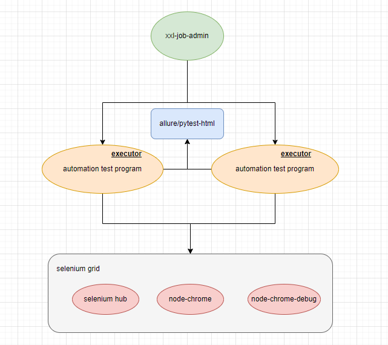
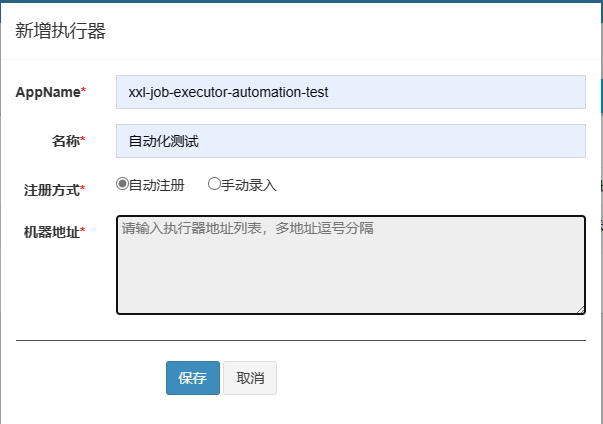
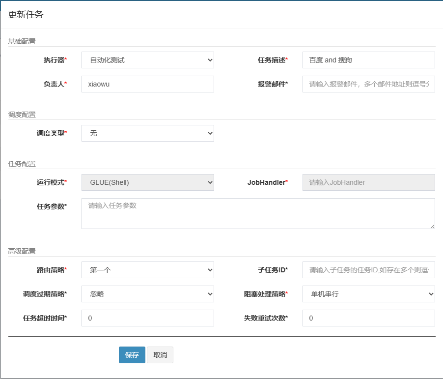
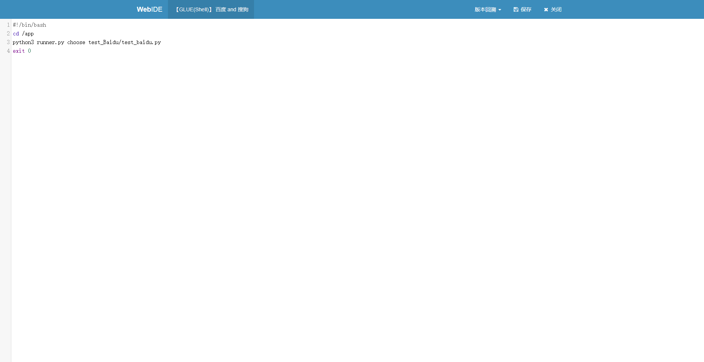
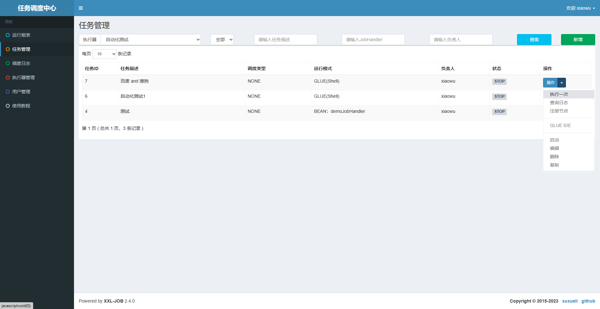
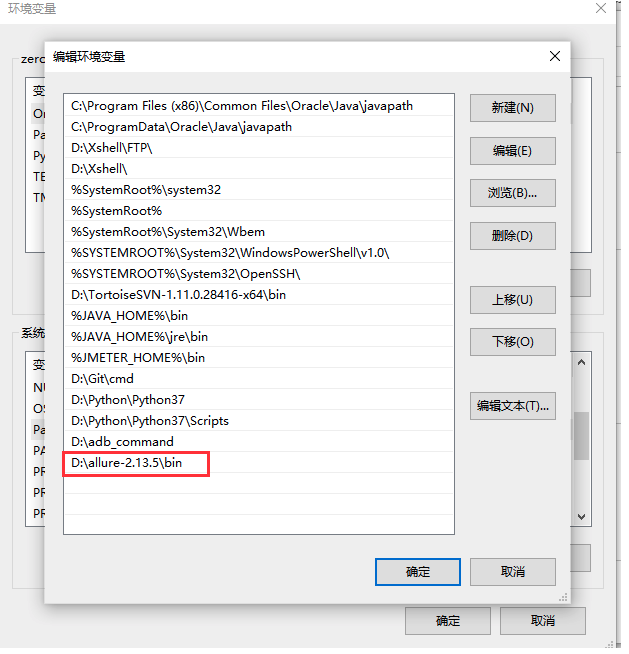

> 欢迎“一键三连[watch,fork,star]”
> 
## 技术沟通群


# 技术栈

> **要求：python3.9.5+**
>
> **pytest + selenium + allure + (ssh/xxl-job)**

# 架构设计



# 操作演示

## 创建执行器



## 创建任务



## 使用`GLUE IDE`编写执行脚本



## 执行任务



## 使用`vnc viewer`同步监控操作流程


# 项目整体分层

```json
├─Common					**公共方法层Common**
├─Outputs					**日志&报告层 Output**
│  ├─allure_report
│  ├─pytest_report
│  ├─running_logs
│  └─running_screenshots
├─PageLocators				**页面元素层PageLocators**
├─PageObjects				**case具体实现的逻辑层PageObjects
├─TestCases					**case层TestCase**
├─main.py					**自动化执行入口main.py**
├─runner.py					**自动化执行入口runner.py**
└─TestDatas					**测试数据层TestDatas**
```

# 项目前置准备

## 环境依赖

### python3和pip3

略

### requirements.txt 依赖包

```python
# 下载依赖
pip3 install -r requirements.txt -i https://pypi.tuna.tsinghua.edu.cn/simple/
```

## **a**llure环境配置

### Linux环境下allure环境配置

（1）配置jdk（因为allure是基于java编写 ）和allure

```bash
curl -L https://download.java.net/java/GA/jdk11/13/GPL/openjdk-11.0.1_linux-x64_bin.tar.gz -o /usr/local/src/openjdk11.tar.gz \
    && cd /usr/local/src && tar -zxvf openjdk11.tar.gz  \
    && rm -f openjdk11.tar.gz  \
    && mv jdk* openjdk11  \
    && curl -L https://repo.maven.apache.org/maven2/io/qameta/allure/allure-commandline/2.22.0/allure-commandline-2.22.0.tgz -o /usr/local/src/allure.tgz \
    && tar -xf /usr/local/src/allure.tgz -C /usr/local/ \
    && mv /usr/local/allure* /usr/local/allure
```

（2）验证allure是否配置成功

```sql
allure --version
```

### Win环境下allure环境配置

**allure下载**

```bash
下载路径一：
在github上下载：https://github.com/allure-framework/allure2/releases
解压到指定文件夹

下载路径二：
在官网下载：https://repo.maven.apache.org/maven2/io/qameta/allure/allure-commandline/
Windows选择一个版本，并选择下载zip文件
```

**环境变量配置**

（1）下载完后直接解压到某路径下，在环境变量path中添加allure路径



（2）验证allure是否配置成功

```sql
allure --version
```

# 本地开发

## chrome driver下载

地址：https://sites.google.com/chromium.org/driver/?pli=1

1. 首先查看chrome浏览器版本：（浏览器设置 -> 关于chrome）


2. 下载对应版本后，解压并运行exe程序即可。默认启动端口9515

## 代码样例

### 实现场景

- 访问百度网站，搜索“搜狗”，搜索结果第一条数据的名称为 搜狗

- 访问百度网站，搜索“淘宝”，搜索结果第一条数据的名称为 淘宝

### 封装页面元素

在`PageLocators`文件夹下，新建`baidu_page_locator.py`

```python
#!/usr/bin/env python3
# -*- coding: utf-8 -*-
# @Time    : 2023/5/14
# @File    : baidu_page_locator.py.py
# @Software: IntelliJ IDEA

__author__ = 'xiaowu'

from selenium.webdriver.common.by import By


class BaiduPageLocator:
    """
    百度首页的页面元素

    """
    # 输入框搜索内容
    searchValue = (By.ID, "kw")

    # 搜索按钮
    searchBtn = (By.ID, "su")

    # 搜索结果第一条数据
    list_name = (By.XPATH, '//*[@id="1"]/div/div[1]/h3/a')
```

### 编写case

在`PageObjects`文件夹下，新建`step_baidu_serach.py`

```python
#!/usr/bin/env python3
# -*- coding: utf-8 -*-
# @Time    : 2023/5/14
# @File    : step_baidu_serach.py.py
# @Software: IntelliJ IDEA

__author__ = 'xiaowu'

from time import sleep

import pytest

from Common.basepage import BasePage
from PageLocators.baidu_page_locator import BaiduPageLocator as BD


class BaiduPage(BasePage):
    def search_sougou(self):
        self.clear_text(BD.searchValue, doc="清除搜索栏")
        self.input_text(BD.searchValue, "搜狗", doc="输入框输入搜狗")
        self.click(BD.searchBtn, doc="点击搜索按钮")
        sleep(1)
        text_search = self.get_element_text(BD.list_name, doc="搜索结果列表的第一条数据")
        return text_search

    def search_taobao(self):
        self.clear_text(BD.searchValue, doc="清除搜索栏")
        self.input_text(BD.searchValue, "淘宝", doc="输入框输入淘宝")
        self.click(BD.searchBtn, doc="点击搜索按钮")
        sleep(1)
        text_search = self.get_element_text(BD.list_name, doc="搜索结果列表的第一条数据")
        return text_search
```

### 对输出结果进行断言

在`TestCases`下，新建`test_baidu.py`

> 一定要以`test_`开头

```python
#!/usr/bin/env python3
# -*- coding: utf-8 -*-
# @Time    : 2023/5/14
# @File    : test_baidu.py.py
# @Software: IntelliJ IDEA

__author__ = 'xiaowu'

import os

import allure
import pytest

from Common import logger
from PageObjects.step_baidu_serach import BaiduPage as BD

root = os.path.dirname(os.path.abspath(__file__))


@allure.feature("模块：百度搜索")
class TestBaidu:

    # function 默认参数传递，autouse=True 自动调用fixture功能
    @pytest.fixture(scope="class", autouse=True)
    def setup(self, browser):
        # `browser`对应这conftest中的browser实例
        # 将browser实例赋值给全局变量driver，以便在测试类中的所有测试方法中都可以使用
        global driver
        driver = browser
        # 通过装饰器pytest.fixture，在执行测试样例时打开百度首页
        driver.get('https://www.baidu.com')

    @pytest.mark.P3
    @allure.story("搜索搜狗")
    def test_search_sougou(self, refresh):
        """
        操作：搜索搜狗
        断言：结果列表展示搜狗
        """

        result_text = BD(refresh).search_sougou()
        logger.logging.info("搜索结果：{}".format(result_text))
        assert result_text == '搜狗'

    @pytest.mark.P1
    @allure.story("搜索淘宝")
    def test_search_taobao(self, refresh):
        """
        操作：搜索淘宝
        断言：结果列表展示淘宝
        """
        result_text = BD(refresh).search_taobao()
        assert result_text == '淘宝网 - 淘！我喜欢'
```

### 编写`conftest.py`

创建`TestCases`文件下的`conftest.py`

> `conftest.py` 是 Pytest 测试框架中的一个特殊文件，用于在测试运行之前进行配置和共享 fixture（夹具）。
>
> 在 Pytest 中，fixture 是一个被用来提供测试数据或初始化测试环境的函数。fixture 函数可以在测试函数中作为参数传递，从而将其返回值注入到测试函数中。这样可以使测试代码更简洁和易于维护。
>
> `conftest.py` 文件通常用于存储 fixture 函数和共享 fixture 函数的配置。当 Pytest 运行测试时，它会自动搜索项目中所有的 `conftest.py` 文件，然后将其中定义的 fixture 函数加载到测试运行环境中，以供测试函数使用。

```python
#!/usr/bin/env python3
# -*- coding: utf-8 -*-
# @Time    : 2023/5/14
# @File    : conftest.py.py
# @Software: IntelliJ IDEA

__author__ = 'xiaowu'

import time

import pytest
from selenium import webdriver
from selenium.webdriver.common.desired_capabilities import DesiredCapabilities

from Common import config, logger
from Common.global_var import GlobalVar


# @pytest.fixture，框架提供的能力。将browser()打上注解，供别人做初始化的调用。
# @pytest.fixture(scope="class") 整个测试类只会执行一次fixture的前置和后置操作，所有的测试方法都将共用同一个fixture实例。
# 这通常适用于需要在多个测试方法之间共享资源的情况，例如数据库连接、浏览器实例等。
# @pytest.fixture(scope='session') 整个测试过程只会执行一次fixture的前置和后置操作，所有的测试类和测试方法都将共用同一个fixture实例。
# 这通常适用于需要在整个测试过程中共享资源的情况，例如登录凭证、全局配置等。
@pytest.fixture(scope="class")
def browser(request):
    global_var = GlobalVar()
    name = global_var.browser
    if name == "chrome":
        # 前置：打开浏览器
        # 修改页面加载策略
        desired_capabilities = DesiredCapabilities.CHROME
        # 注释这两行会导致最后输出结果的延迟，即等待页面加载完成再输出
        desired_capabilities["pageLoadStrategy"] = "none"
        chrome_options = webdriver.ChromeOptions()
        chrome_options.set_capability("version", config.configs.driver.version)
        chrome_options.set_capability("platform", 'ANY')
        chrome_options.set_capability("javascriptEnabled", True)
        # 实例化对象
        # browser = webdriver.Chrome()
        browser = webdriver.Remote(command_executor=config.configs.driver.addr, options=chrome_options)
        # 窗口最大化
        browser.maximize_window()
        # 等待
        time.sleep(1)
        # 返回对象
        yield browser
    else:
        # 前置：打开浏览器
        # 修改页面加载策略
        desired_capabilities = DesiredCapabilities.EDGE
        # 注释这两行会导致最后输出结果的延迟，即等待页面加载完成再输出
        desired_capabilities["pageLoadStrategy"] = "none"
        browser = webdriver.Edge()
        # 窗口最大化
        browser.maximize_window()
        # 等待
        time.sleep(1)
        # 返回对象
        yield browser

    def fn():
        logger.logging.info("全部用例执行完, teardown driver!")
        # 后置：关闭浏览器
        browser.quit()

    request.addfinalizer(fn)
    return browser


# 写每条case，的时候都会传入refresh方法
# 如 test_a_channel_search(self, refresh):
# 则执行顺序，就是在正式执行case执行之前，先执行refresh这个方法
@pytest.fixture
def refresh(browser):
    yield browser
    # 刷新页面
    browser.refresh()
    # 操作1
    # browser.find_element(*LP.s).click()
    # 操作2
    # browser.find_element(*LP.che).click()
    time.sleep(1)


# pytest_configure函数是pytest提供的一个钩子函数，它可以在pytest运行前对pytest进行配置
# 通过在该函数中添加代码，可以添加自定义的配置、marker、插件等
def pytest_configure(config):
    config.addinivalue_line("markers", 'smoke')
    config.addinivalue_line("markers", 'P0')
    config.addinivalue_line("markers", 'P1')


# 测试用例收集完成时，将收集到的item的name和nodeid的中文显示在控制台上
def pytest_collection_modifyitems(items):
    for item in items:
        item.name = item.name.encode("utf-8").decode("unicode_escape")
        # print(item.nodeid)
        item._nodeid = item.nodeid.encode("utf-8").decode("unicode_escape")
```

### 执行入口

执行`python3 main.py`

```python
注：
pytest.main()  # main中传入不同的指令用以执行指定测试用例
-s: 显示程序中的print/logging输出
-v: 丰富信息模式, 输出更详细的用例执行信息
-k：关键字匹配，用and区分：匹配范围（文件名、类名、函数名）
-m: 匹配标签，pytest -m "tag名称"  #运行指定tag名称的用例，也就是运行有@pytest.mark.[标记名]这个标记的case
```

# 项目部署

## 安装docker，docker-compose

略

## 安装xxl-job-admin(2.4)

参考：https://github.com/behappy-project/behappy-docker-application/blob/master/xxl-job-admin/docker-compose.yml

执行：`docker-compose -f docker-compose.yml up -d`

## 安装selenium grid

参考：https://github.com/SeleniumHQ/docker-selenium/tree/3.141.59-zirconium

执行：`docker-compose -f selenium.yml up -d`

## 执行部署

项目根目录执行：`sh execute.sh`
