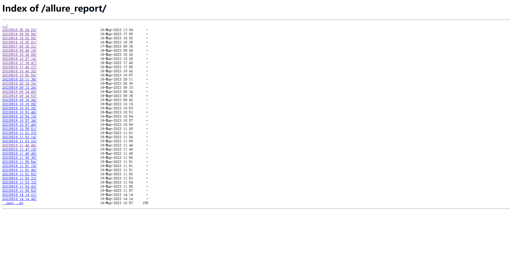
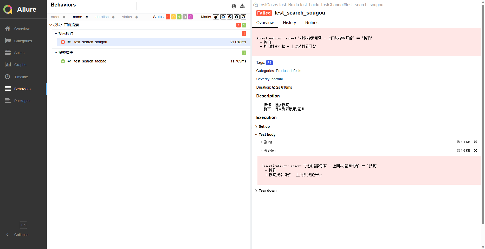

# 技术栈

> **要求：python3.9.5+**
>
> - pytest + selenium + allure + (ssh/xxl-job)
>
> - 小程序：minium 【腾讯官方开发的自动化框架】 + 微信开发者工具【开发者工具仅提供mac/windows，同时也没有对应的无头测试方案】

# 架构设计


# 操作演示

## 创建执行器


## 创建任务


## 使用`GLUE IDE`编写执行脚本


## 执行任务


## 查看结果报告


```
自动化测试执行任务管理：https://automation-test.extension.sopei/xxl-job-admin/
allure报表：https://automation-test.extension.sopei/Outputs/allure_report
pytest报表：https://automation-test.extension.sopei/Outputs/pytest_report
小程序用户端：https://automation-test.extension.sopei/Outputs/wx_u_report/
搜搜汽配：https://automation-test.extension.sopei/Outputs/wx_oe_report
```

访问`https://automation-test.extension.sopei/Outputs/allure_report`





# 项目整体分层

```json
├─Common					**公共方法层Common**
├─Outputs					**日志&报告层 Output**
│  ├─allure_report
│  ├─pytest_report
│  ├─running_logs
│  └─running_screenshots
├─PageLocators				**页面元素层PageLocators**
├─PageObjects				**case具体实现的逻辑层PageObjects
├─TestCases					**case层TestCase**
├─main.py					**自动化执行入口main.py**
├─runner.py					**自动化执行入口runner.py**
└─TestDatas					**测试数据层TestDatas**
```

# 项目前置准备

## 环境依赖

### Jdk8+

略

### python3.10+

https://www.python.org/downloads/windows/

### requirements.txt 依赖包

```python
# 下载依赖
pip install -r requirements.txt -i https://pypi.tuna.tsinghua.edu.cn/simple/
```

## **a**llure环境配置

### Win环境下allure环境配置

**allure下载**

```bash
下载路径一：
在github上下载：https://github.com/allure-framework/allure2/releases
解压到指定文件夹

下载路径二：
在官网下载：https://repo.maven.apache.org/maven2/io/qameta/allure/allure-commandline/
Windows选择一个版本，并选择下载zip文件
```

**环境变量配置**

（1）下载完后直接解压到某路径下，在环境变量path中添加allure路径


（2）验证allure是否配置成功

```sql
allure --version
```

## 禁止谷歌浏览器更新

参考：https://www.cnblogs.com/mq0036/p/13947021.html

## chrome driver下载

地址：https://sites.google.com/chromium.org/driver/?pli=1

1. 首先查看chrome浏览器版本：（浏览器设置 -> 关于chrome）


2. 下载对应版本后，放在指定路径下如：`C:\Software\chromedriver-win64`

# 项目部署

## 安装docker，docker-compose

略

## 安装xxl-job-admin(要求2.4)

- 执行sql：https://github.com/xuxueli/xxl-job/blob/2.4.0/doc/db/tables_xxl_job.sql

```dockerfile
version: '3'
services:
  xxl-job-admin:
    # 对比原版，新增了ldap认证
    image: wangxiaowu950330/xxl-job-admin:v2.4.0
    restart: 'no'
    container_name: xxl-job-admin
    environment:
      PARAMS: '--spring.datasource.url=jdbc:mysql://127.0.0.1:3306/automation_test?Unicode=true&characterEncoding=UTF-8 --spring.datasource.username=root --spring.datasource.password=root --spring.data.ldap.repositories.enabled=true --spring.ldap.urls=ldap://127.0.0.1:388 --spring.ldap.base=dc=extension,dc=net --spring.ldap.username=cn=admin,dc=extension,dc=net --spring.ldap.password=123456'
    ports:
      - "38080:8080"
    volumes:
      - ./data/applogs:/data/applogs
```

- 执行：`docker-compose -f docker-compose.yml up -d`

## xxl-job执行器启动

> 保证执行器执行启动路径位于`C:/Project/TestAutomation`

```shell
java -jar xxl-job-executor-sample-springboot-2.4.0.jar --xxl.job.admin.addresses=http://{admin ip:admin端口}/xxl-job-admin --xxl.job.accessToken=default_token --xxl.job.executor.appname=xxl-job-executor-automation-test --xxl.job.executor.address=http://{执行器ip:执行器端口}
```

## 静态文件代理

```python
python -m http.server 12345 -d C:/Automation_test/Outputs
```

