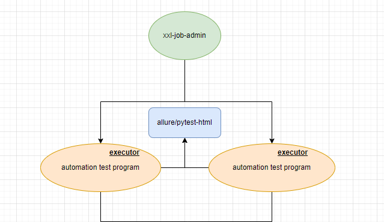

# 技术栈

> **要求：python3.10+**
>
> - pytest + selenium + allure + xxl-job
> - 小程序：minium 【腾讯官方自动化框架】 + 微信开发者工具【开发者工具仅提供mac/windows，同时也没有对应的无头测试方案】
> - 服务器：windows【当需要利用gui运行的driver工具时，就会发现windows有多香了】

其它技术栈查阅 `requirements.txt`



# 环境准备

## 安装系统依赖

- 安装微软常用运行库合集_2023.05.15

## 安装python依赖模块

```
pip install -r requirements.txt -i https://pypi.tuna.tsinghua.edu.cn/simple/
```

## 安装openjdk8或jdk8

## 安装maven

## 安装allure

### **allure下载**

```bash
下载路径一：
在github上下载：https://github.com/allure-framework/allure2/releases
解压到指定文件夹

下载路径二：
在官网下载：https://repo.maven.apache.org/maven2/io/qameta/allure/allure-commandline/
Windows选择一个版本，并选择下载zip文件
```

### **环境变量配置**

（1）下载完后直接解压到某路径下，在环境变量path中添加allure路径


（2）验证allure是否配置成功

```sql
allure --version
```

## selenium server对应浏览器驱动

- 配置selenium server

  - 下载selenium-server-standalone-3.141.0.jar
  - 下载地址:http://selenium-release.storage.googleapis.com/index.html
  - 以管理员身份启动服务:java -jar selenium-server-standalone-3.141.0.jar -log selenium.log

- 下载浏览器驱动

  - 谷歌浏览器：

    https://chromedriver.storage.googleapis.com/index.html

    - 驱动支持的最低浏览器版本：https://raw.githubusercontent.com/appium/appium-chromedriver/master/config/mapping.json

  - 火狐浏览器：

    https://github.com/mozilla/geckodriver/

    - 驱动支持的浏览器版本：https://firefox-source-docs.mozilla.org/testing/geckodriver/geckodriver/Support.html

  - IE浏览器(建议使用32位,64位操作极慢)：http://selenium-release.storage.googleapis.com/index.html

  - 将驱动所在目录加入到selenium server服务器系统环境变量:export PATH=/home/john/selenium/:$PATH

- IE浏览器设置

  - 在Windows Vista、Windows7系统上的IE浏览器在IE7及以上版本中，需要设置四个区域的保护模式为一样，设置开启或者关闭都可以。
    - 工具-->Internet选项-->安全
  - IE10及以上版本增强保护模式需要关闭。
    - 工具-->Internet选项-->高级
  - 浏览器缩放级别必须设置为100%，以便本地鼠标事件可以设置为正确的坐标。
  - 针对IE11需要设置注册表以便于浏览器驱动与浏览器建立连接
    - Windows 64位：HKEY_LOCAL_MACHINE\SOFTWARE\Wow6432Node\Microsoft\Internet Explorer\Main\FeatureControl\FEATURE_BFCACHE
    - Windows 32位：HKEY_LOCAL_MACHINE\SOFTWARE\Microsoft\Internet Explorer\Main\FeatureControl\FEATURE_BFCACHE
    - 如果FEATRUE_BFCACHE项不存在，需要创建一个，然后在里面创建一个DWORD(32位)，命名为iexplore.exe，值为0
    - Windows 64位两个注册表建议都设置
  - IE8及以上版本设置支持inprivate模式，以便多开IE窗口时cookies能够独享
    - HKKY_CURRENT_USER\Software\Microsoft\Internet Explorer\Main 下建一个名为TabProcGrowth的DWORD(32位)，值为0
  - 重启系统
  - 注:https://github.com/SeleniumHQ/selenium/wiki/InternetExplorerDriver#required-configuration

# 修改配置

- `config/web_ui_config.conf` 配置web ui自动化的测试信息
- `config/projectName/projectName.conf` 配置测试项目的信息

# 运行测试

## API测试

- python3 -u run_api_test.py --help
- python3 -u run_api_test.py 运行cases/api/目录所有的用例
- python3 -u run_api_test.py -k keyword 运行匹配关键字的用例，会匹配文件名、类名、方法名
- python3 -u run_api_test.py -d dir 运行指定目录的用例，默认运行cases/api/目录
- python3 -u run_api_test.py -m mark 运行指定标记的用例

## web ui测试

- python3 -u run_web_ui_test.py --help
- python3 -u run_web_ui_test.py 运行cases/web_ui/目录所有的用例
- python3 -u run_web_ui_test.py -k keyword 运行匹配关键字的用例，会匹配文件名、类名、方法名
- python3 -u run_web_ui_test.py -d dir 运行指定目录的用例，默认运行cases/web_ui/目录
- python3 -u run_web_ui_test.py -m mark 运行指定标记的用例

```powershell
Write-Host "开始执行！！！"
# 多个mark以英文逗号拼接
$test_mark="xxx,xxx,xxx"
# 环境
$cmd_environment=$args[0..($args.Count-3)]
# 并行任务数量
$num="4"
# 是否清除case产生的数据
$need_clear=0
python -u run_web_ui_test.py -m "$test_mark" --cmd_environment "$cmd_environment" --num "$num" --need_clear $need_clear
Write-Host "Good bye!"
exit 0
```

## 小程序测试

```powershell
chcp 65001
Write-Host "开始执行！！！"
# 使用utf8-nobom的方式写入文件
function Write-Utf8NoBom {
  param(
    [Parameter(Mandatory = $true)]
    [string] $Path,
    [Parameter(Mandatory = $true)]
    [string] $Content
  )
  # Convert the string content to a UTF-8 byte array
  $utf8Bytes = [System.Text.Encoding]::UTF8.GetBytes($Content)
  # Write the byte array to the specified file
  [System.IO.File]::WriteAllBytes($Path, $utf8Bytes)
}

# 执行case类型[可选值: byCases,bySuite]
$case_type="bySuite"
# 执行case文件[eg: wx_demo_project.test_data_project]
$case_file="xxx"
# 执行case名称[eg: test_weapp_u]，不支持多个
$case_name="xxx"
# configJson文件路径[eg: config/wx_demo_project/config.json]
$config_json="xxx"
# suiteJson文件路径[eg: config/wx_demo_project/suite.json]
$config_suite="xxx"
# suite json param
$suiteJsonContent = @"
{
  "pkg_list": [
    {
      "case_list": [
        "test_weapp_u_1"
      ],
      "pkg": "cases.wx.wx_demo_project.test_*"
    },
    {
      "case_list": [
        "test_weapp_u_2"
      ],
      "pkg": "cases.wx.wx_demo_project.test_*"
    }
  ]
}
"@
# 清空$config_suite
Clear-Content "$config_suite"
# 重新写入
Write-Utf8NoBom -Path "$config_suite" -Content $suiteJsonContent
$local=0
# 环境
$cmd_environment=$args[0..($args.Count-3)]

python -u run_wx_test.py --local $local -ct "$case_type" -cf "$case_file" -cn "$case_name" -cj "$config_json" -cs "$config_suite"

Write-Host "Good bye!"
exit 0
```

# 生成测试报告

## API测试

```powershell
Write-Host "开始执行！！！"
# 清除任务类型
$need_clear=1
# 环境
$cmd_environment=$args[0..($args.Count-3)]
python -u generate_api_test_report.py --need_clear $need_clear --cmd_environment "$cmd_environment"
Write-Host "Good bye!"
exit 0
```

## web ui测试

```powershell
Write-Host "开始执行！！！"
# 浏览器类型,默认为谷歌
$test_type="-c True"
# 清除任务类型
$need_clear=1
# 环境
$cmd_environment=$args[0..($args.Count-3)]
python -u generate_web_ui_test_report.py "$test_type" --need_clear $need_clear --cmd_environment "$cmd_environment"
Write-Host "Good bye!"
exit 0
```

## 小程序测试

```powershell
Write-Host "开始执行！！！"
# 类型【取决于config.json中配置的outputs路径】
$type="xxx"
# 环境
$cmd_environment=$args[0..($args.Count-3)]
python -u generate_wx_report.py --type "$type"
Write-Host "Good bye!"
exit 0
```

# 项目结构

- base    基础请求类
- cases    测试用例目录
- common    公共模块
- common_projects    每个项目的公共模块
- config　 配置文件
- init    初始化/格式化
- logs    日志目录
- output    测试结果输出目录
- page_objects    页面映射对象
- pojo     存放自定义类对象
- test_data    测试所需的测试数据目录
- run_api_test.py    运行api测试脚本
- run_web_ui_test.py    运行web ui测试脚本
- run_wx_test.py    运行小程序测试脚本
- generate_api_test_report.py    生成api测试报告
- generate_web_ui_test_report.py    生成web ui测试报告
- generate_wx_report.py    生成小程序测试报告

# 生产部署/运行

## xxl-job-admin【2.4.0】

```shell
java -jar xxl-job-admin-2.4.0.jar
```

## xxl-job-executor【2.4.0】

> 将`xxl-job-executor-sample-springboot-2.4.0.jar`放在自动化测试项目的根目录下

```shell
java -jar xxl-job-executor-sample-springboot-2.4.0.jar --xxl.job.admin.addresses=http://127.0.0.1:8080/xxl-job-admin --xxl.job.accessToken=default_token --xxl.job.executor.appname=xxl-a --xxl.job.executor.address=http://10.0.1.69:9998 --xxl.job.executor.port=9998 --server.port=8082
```

```shell
java -jar xxl-job-executor-sample-springboot-2.4.0.jar --xxl.job.admin.addresses=http://127.0.0.1:8080/xxl-job-admin --xxl.job.accessToken=default_token --xxl.job.executor.appname=xxl-b --xxl.job.executor.address=http://10.0.1.69:9999 --xxl.job.executor.port=9999 --server.port=8081
```

...
