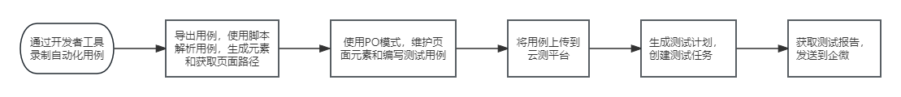

### 小程序自动化测试

整体技术方案如下图：

### [对应小程序Demo代码仓库](https://github.com/behappy-other/weapp-qrcode)

> project.config.json中的appId需要修改为个人的

### 框架介绍

- TestCases：测试用例
- Wx
  - base：封装页面公共方法和测试基类的封装
    - base/basedef中，我们封装了一些minium框架的方法，如页面跳转，点击元素，文本输入方法等，可以根据自己的需求进行封装
    - base/basepage，是测试用例的基类，这里可以封装一些用例执行之前的操作
  - common：存放公共方法，如读取脚本
    - common/read_script，此函数的作用是读取自动化脚本中的元素和页面路径，打印元素和创建页面
  - data：存放一些测试数据
  - page：生成的页面路径，维护各页面的元素和操作方法
  - script：通过开发者工具录制导出的自动化脚本
  - tools：存放工具方法
    - tools/cloud_test_output.py，用于创建云测测试任务，并将测试报告发送到企微

具体文章地址可以参考文章 [云测服务最佳实践 -- 群接龙](https://developers.weixin.qq.com/community/business/doc/000a0c1d4d41a8e9e7506487c6b40d)
